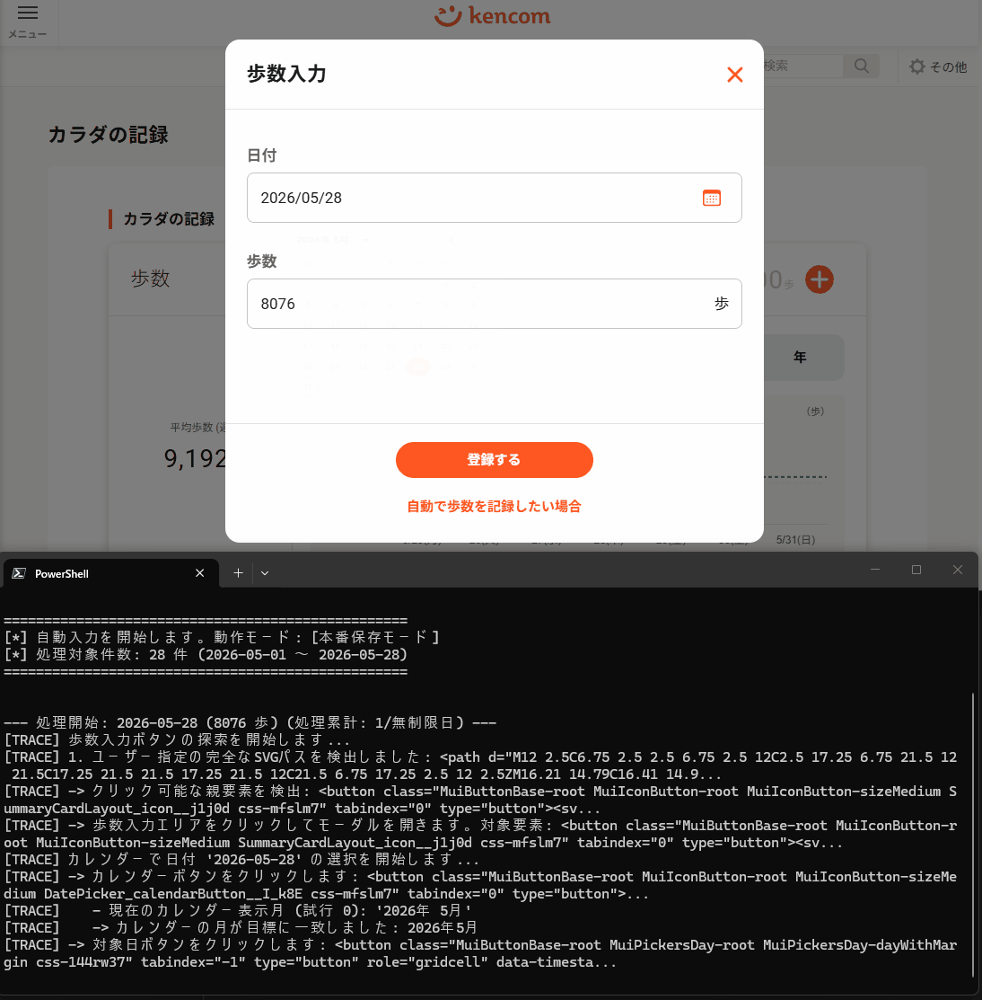

# kencom 歩数自動入力スクリプト

CSVファイルから歩数データを読み取り、すでにブラウザでログイン済みのkencomの「カラダの記録」ページへ自動で一括入力を行うPythonスクリプトです。

安全性を考慮し、ログイン認証や二段階認証はユーザー自身が手動で行った後のChromeブラウザに対して、Pythonスクリプトから自動操作（アタッチ）する方式を採用しています。



---

## 🛠 事前準備

本スクリプトを動かすためには、**歩数データを記録したcsvファイル** と **「リモートデバッグモード」で起動した専用のChromeブラウザ**が必要です。

### 1. 歩数データの準備

1. 歩数データをCSVファイルとして保存してください。形式は以下の通りです。
```csv
date,count
2026-05-28,8000
2026-05-27,9000
```

2. HuaweiヘルスからのCSV化は、[Qiita記事](https://qiita.com/vodka_pythonian/items/f3103efc7a17ce454f2b)を参照。

### 2. Chromeをリモートデバッグモードで起動する

1. **起動中の通常のChromeを完全に終了させます**（タスクトレイも含めて完全に閉じてください）。
2. **PowerShell** または **コマンドプロンプト** を開き、以下のコマンドを実行してデバッグ用Chromeを起動します。

   ```powershell
   # PowerShell の場合
   & "C:\Program Files\Google\Chrome\Application\chrome.exe" --remote-debugging-port=9222 --user-data-dir="C:\ChromeDebug"
   ```

   *※他のユーザーデータで動かしたい場合は `--user-data-dir` のパスを任意のディレクトリに変更して構いません。*

3. 起動したChromeで [kencom（ケンコム）のカラダの記録ページ](https://kencom.jp/vitals) を開き、ログインを完了させます。

### 3. 依存関係のセットアップ

本プロジェクトフォルダで以下のコマンドを実行し、ライブラリをインストールします。

```bash
uv sync
```

---

## 🚀 使い方

基本的には、作成されたバッチファイルをダブルクリックするだけで実行できます。

### A. バッチファイルで簡単実行（Windows）

`run.bat` をダブルクリックするだけで自動的に実行が始まります。

### B. コマンドラインから実行

ターミナルから詳細なオプションを指定して実行できます。

#### 1. まずはテストモードで動作確認 (推奨)
実際にはデータを保存せず、要素の特定や日付切り替えのテストのみを行います。
```bash
uv run python kencom_auto_fill.py --dry-run
```

#### 2. 本番保存モードで実行
CSVの歩数データを実際に保存します。
```bash
uv run python kencom_auto_fill.py
```

---

## ⚙ コマンドライン引数（オプション）

| 引数 | 説明 | デフォルト値 |
| :--- | :--- | :--- |
| `--csv` | 歩数CSVファイルのパス | `steps_may_2026.csv` |
| `--port` | Chromeのデバッグポート番号 | `9222` |
| `--dry-run` | 実際に入力・保存せずテスト遷移する | - |
| `--debug-dom` | 現在開いているページのHTML要素を一覧表示して終了する | - |
| `--wait` | 各ステップ間の待機秒数（回線やPC速度に応じて調整） | `1.5` |

---

## 🔍 トラブルシューティング（UIが変更された場合など）

もし「歩数入力ボタンが見つからない」「前日ボタンが見つからない」などのエラーが発生した場合、以下のコマンドを実行してください。

```bash
uv run python kencom_auto_fill.py --debug-dom
```

このコマンドを実行すると、現在ブラウザに表示されているページのHTMLのボタン、リンク、入力欄などをターミナルに一覧表示します。これにより、kencom側のUIデザインやクラス名がアップデートされた場合でも、セレクタを迅速に特定してスクリプトをメンテナンスできます。
